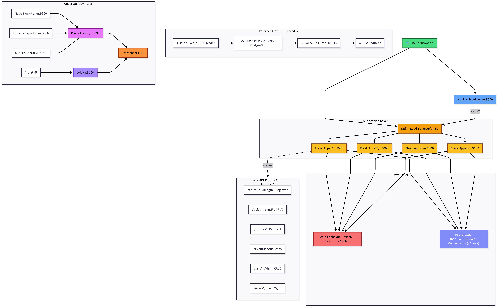

# Meta Production Engineering Hackathon

This is the most scalable, reliable and guaranteed to wake up the on-call engineer url-shortner of all time. Provided to you by 4 students from Canada, 2 from Waterloo and 2 from Concordia.

## Quick Links

- [Getting Started](#getting-started)
- [Diagram](#architecture)
- [Apis](#endpoints)
- [Deploy Guide](#deploy-guide)
- [Troubleshooting](#troubleshooting)
- [Config](#config)
- [Runbooks](#runbooks)
- [Decision Log](#decision-log)
- [Capacity Plan](#capacity-plan)
- [License](#license)

---

## Getting Started

### Prerequisites

- Docker & Docker Compose
- Node.js 20+ (for local frontend dev)
- Python 3.11+ with uv package manager

### Initial Setup

For the setup instructions, we will assume the user remains in the same directory as indicated by the steps.

1. Clone this repository:

```bash
git clone <repository-url>
cd MetaHackathon # remain in this directory
```

2. Create a `.env` file:

```bash
touch .env
```

3. Start the full stack with Docker:

```bash
docker compose up --build -d
```

4. Verify services are running:

- **API:** http://localhost:5000/health
- **Frontend:** http://localhost:3000
- **Prometheus:** http://localhost:9090
- **Grafana:** http://localhost:3001

For logging in to Grafana, users can user `admin` as the username and `admin` as the password`

---

## Architecture



---

## Endpoints

### Health Checks

- `GET /health` - Service health status
- `GET /health/live` - Liveness probe
- `GET /health/ready` - Readiness probe

### Links API

- `POST /links/create` - Create a short URL
- `GET /links/<id>` - Retrieve link metadata

### Authentication

- `POST /auth/register` - Register a new user
- `POST /auth/login` - User login

---

## Deploy Guide

### Staging

Instructions for deploying to staging environment.

### Production

Instructions for deploying to production environment.

---

## Troubleshooting

### Common Issues

#### Services won't start

- Check Docker is running
- Verify `.env` variables are set correctly
- Review logs: `docker compose logs -f <service>`

#### Database connection errors

- Ensure PostgreSQL is healthy: `docker compose ps db`
- Check connection string in `.env`

#### Prometheus has no data

- Verify exporters are running: `docker compose ps`
- Check scrape targets: http://localhost:9090/targets

### Advanced Debugging
Debugging issues, especially during runtime can be facilitated by the detailed logs we included in the application. These log files are generated locally in `./logs/app*` for each instance of the server.

The log files must include the following fields:

- `ts`: time log was recorded
- `level`: level of importance
- `logger`: the application instance that logged the entry
- `event`: event recorded in the application such as `request_completed`
- `service`: which service the log occured in


Logs can have additional entries to become traces. The additional entries can include:

- `endpoint`: The endpoint the log occured on
- `user_id`: Which user caused the log
- `method`: Whether it was a POST/GET request
 
- . . . (more defined in `init.py` in the `JsonFormatter` class)

So, if a bug occurs, a good first step is to look through the logs at the time it occured, and look for a `WARNING` or `ERROR` log.

Users can consult the log file by SSHing in the machine running the application or by going to `localhost:3001` on the explore tab and query logs with Loki.
  

---

## Config

### Environment Variables

| Variable | Example | Description |
|----------|---------|-------------|
| `DATABASE_HOST` | `localhost` | PostgreSQL host |
| `DATABASE_PORT` | `5432` | PostgreSQL port |
| `DATABASE_USER` | `postgres` | DB user |
| `DATABASE_PASSWORD` | `postgres` | DB password |
| `REDIS_URL` | `redis://redis:6379` | Redis connection |
| `SECRET_KEY` | `secret` | Flask secret key |
| `SMTP_SMARTHOST` | `smtp.gmail.com:587` | SMTP server (for alerts) |
| `SMTP_FROM` | `alerts@example.com` | Alert sender email |

---

## Runbooks

### Incident Response

- [Backend Outage](#)
- [Database Issues](#)
- [High Latency](#)

### Operational Tasks

- [Scaling the Backend](#)
- [Backup Procedures](#)
- [Log Access](#)

---

## Decision Log

Record architectural decisions, trade-offs, and rationale.

| Date | Decision | Rationale |
|------|----------|----------|
| 2026-04-04 | Use process-exporter for app visibility | Avoids direct app scraping |
| 2026-04-04 | Multi-container observability stack | Comprehensive monitoring |

---

## Capacity Plan

### Current Limits

- **API Throughput:** TBD req/s
- **Database:** PostgreSQL 16, 10GB storage
- **Cache:** Redis, X GB

### Growth Plan

Document scaling strategy and projected timelines.

---

## License

This project is licensed under the MIT License. See [LICENSE](LICENSE).
