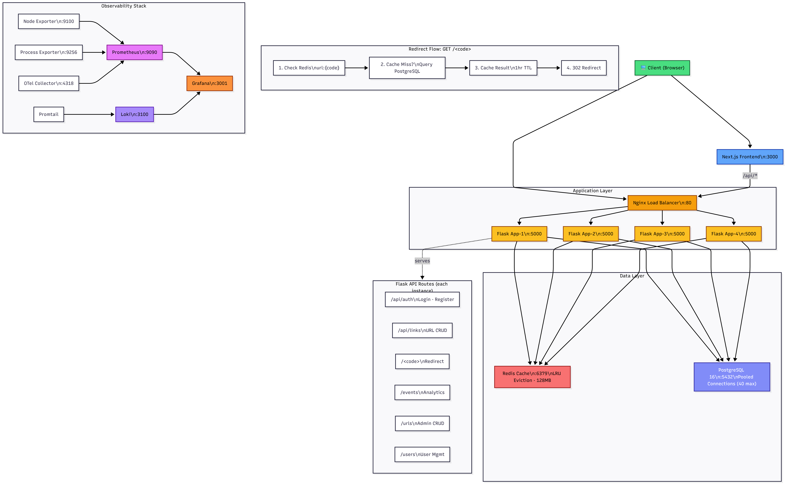

# Meta Production Engineering Hackathon

This is the most scalable, reliable and guaranteed to wake up the on-call engineer url-shortner of all time. Provided to you by 4 students from Canada, 2 from Waterloo and 2 from Concordia.

## Quick Links

- [Getting Started](#getting-started)
- [Diagram](#architecture)
- [Apis](#endpoints)
- [Deploy Guide](#deploy-guide)
- [Troubleshooting](#troubleshooting)
- [Config](#config)
- [Runbooks](#runbooks)
- [Decision Log](#decision-log)
- [Capacity Plan](#capacity-plan)
- [License](#license)

---

## Getting Started

### Prerequisites

- Docker & Docker Compose
- Node.js 20+ (for local frontend dev)
- Python 3.11+ with uv package manager

### Initial Setup

For the setup instructions, we will assume the user remains in the same directory as indicated by the steps.

1. Clone this repository:

```bash
git clone <repository-url>
cd MetaHackathon # remain in this directory
```

2. Create a `.env` file:

```bash
touch .env
```

3. Start the full stack with Docker:

```bash
docker compose up --build -d
```

4. Verify services are running:

- **API:** http://localhost:5000/health
- **Frontend:** http://localhost:3000
- **Prometheus:** http://localhost:9090
- **Grafana:** http://localhost:3001

For logging in to Grafana, users can user `admin` as the username and `admin` as the password`

---

## Architecture



---

## Endpoints

### Health Checks

- `GET /health` - Service health status
- `GET /health/live` - Liveness probe
- `GET /health/ready` - Readiness probe

### Links API

- `POST /links/create` - Create a short URL
- `GET /links/<id>` - Retrieve link metadata

### Authentication

- `POST /auth/register` - Register a new user
- `POST /auth/login` - User login

---

## Deploy Guide

### Staging

Instructions for deploying to staging environment.

### Production

Instructions for deploying to production environment.

---

## Troubleshooting

### Common Issues

#### Services won't start

- Check Docker is running
- Verify `.env` variables are set correctly
- Review logs: `docker compose logs -f <service>`

#### Database connection errors

- Ensure PostgreSQL is healthy: `docker compose ps db`
- Check connection string in `.env`

#### Prometheus has no data

- Verify exporters are running: `docker compose ps`
- Check scrape targets: http://localhost:9090/targets

### Advanced Debugging
Debugging issues, especially during runtime can be facilitated by the detailed logs we included in the application. These log files are generated locally in `./logs/app*` for each instance of the server.

The log files must include the following fields:

- `ts`: time log was recorded
- `level`: level of importance
- `logger`: the application instance that logged the entry
- `event`: event recorded in the application such as `request_completed`
- `service`: which service the log occured in


Logs can have additional entries to become traces. The additional entries can include:

- `endpoint`: The endpoint the log occured on
- `user_id`: Which user caused the log
- `method`: Whether it was a POST/GET request
 
- . . . (more defined in `init.py` in the `JsonFormatter` class)

So, if a bug occurs, a good first step is to look through the logs at the time it occured, and look for a `WARNING` or `ERROR` log.

Users can consult the log file by SSHing in the machine running the application or by going to `localhost:3001` on the explore tab and query logs with Loki. In the worst case, if even `localhost:3001` is inaccessible, logs are stored for long term storage in an Amazon S3 storage through Loki, to be accessed from the cloud.

#### 3 Example Bugs

1. Caching Problem  
One example problem we faced was during scalability testing where we were faced with too many cache misses, requiring us to visit the main Postgress database. Thanks to our test logs which displayed the cache miss and hit percentages, we were able to decrease the misses from 30% to 15%.

2. Latency Problem  
When stress testing our architecture, we originally had a single instance which ended up causing a lot of latency when we had a lot of requests at once. We knew that one of the ways to decrease latency under load woul dbe to scale horizontally, so we set up tests to track latency with 1 instance, 2, 3, 4, and 5 instances, and 4 instances performed the best. We were able to track and confirm this thanks to our metrics, allowing us to implement a robust solution.

3. Malformed Data  
One of the problems we had was with malformed data and we would get a lone error message. When fixing that problem we didn't yet have logging, but now we get warning in our logs. We were able to find there was a problem by adding unit tests, but having logs earlier would have helped pinpoint the issue faster.

---

## Config

### Environment Variables

| Variable | Example | Description |
|----------|---------|-------------|
| `DATABASE_NAME` | `hackathon_db` | PostgreSQL database name |
| `DATABASE_HOST` | `db` | PostgreSQL host inside Docker network |
| `DATABASE_PORT` | `5432` | PostgreSQL port |
| `DATABASE_USER` | `postgres` | DB user |
| `DATABASE_PASSWORD` | `postgres` | DB password |
| `REDIS_URL` | `redis://redis:6379` | Redis connection |
| `SECRET_KEY` | `random_secret_key` | Flask secret key |
| `LOG_LEVEL` | `INFO` | Application log verbosity |
| `LOG_FILE_PATH` | `/app/logs/app-1.log` | Per-instance app log file path |
| `LOG_FILE_MAX_BYTES` | `10485760` | Max size for a single rotated log file |
| `LOG_FILE_BACKUP_COUNT` | `5` | Number of rotated log files to retain |
| `OTEL_EXPORTER_OTLP_ENDPOINT` | `http://otel:4318` | OpenTelemetry collector endpoint |
| `FLASK_HOST` | `0.0.0.0` | Flask bind address (if running directly) |
| `FLASK_PORT` | `5000` | Flask port (if running directly) |
| `FLASK_DEBUG` | `false` | Flask debug mode toggle |
| `SMTP_SMARTHOST` | `smtp.gmail.com:587` | SMTP relay for Alertmanager |
| `SMTP_FROM` | `alerts@example.com` | Alert sender email |
| `SMTP_AUTH_USERNAME` | `smtp-user` | SMTP auth username |
| `SMTP_AUTH_PASSWORD` | `smtp-password` | SMTP auth password |
| `ALERT_EMAIL_TO` | `oncall@example.com` | Alert recipient email |
| `ALERT_SMS_TO` | `+15551234567` | Alert recipient phone (if SMS integration is configured) |
| `DISCORD_WEBHOOK_URL` | `https://discord.com/api/webhooks/...` | Discord webhook for alerts |
| `S3_KEY` | `AKIA...` | AWS access key for Loki object storage |
| `SECRET_S3_KEY` | `***` | AWS secret key for Loki object storage |
| `AWS_REGION` | `us-east-1` | AWS region for Loki S3 bucket |
| `LOKI_S3_BUCKET` | `metahackathon-loki-logs` | S3 bucket used by Loki for long-term log storage |

---

## Runbooks

### Incident Response

- [Backend Outage](#)
- [Database Issues](#)
- [High Latency](#)

### Operational Tasks

- [Scaling the Backend](#)
- [Backup Procedures](#)
- [Log Access](#)

---

## Decision Log


---

## Capacity Plan

### Current Limits

- **API Throughput:** TBD req/s
- **Database:** PostgreSQL 16, 10GB storage
- **Cache:** Redis, X GB

### Growth Plan

Document scaling strategy and projected timelines.

---

## License

This project is licensed under the MIT License. See [LICENSE](LICENSE).
